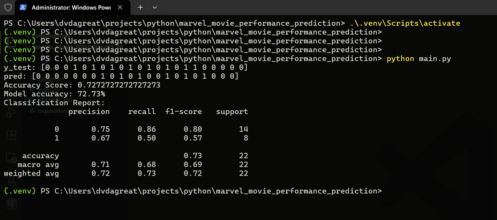

A Simple Logistic Regression prediction system that predicts if a Marvel Movie will become a Smash hit or not

<br/>

## The Dataset ##

The dataset is generated using LLM and located in dataset/marvel_movie_data.csv

The dataset lists all the Marvel movie from 2000 to 2024, which includes
- Original Marvel Studios Productions
- Sony & Fox universe collaboration movies like Spiderman, X-men, Wolverine, etc.

Each entry in the dataset has multiple genres, directors, cast members (categorical data)

Each entry has a worldwide_collection column which is used to determine if the movie is smash hit or not 

<br/>

## Implementation Details ##

A Marvel movie is considered a Smash hit only if it earns more than 800 Million dollars
- NOTE: this is a made-up metric only only for the purposes of this model

Scikit-learn was used for data preprocessing, model training, predicting data & prediction metrics

<br/>


## Steps to install and run ##

### 1) Install dependencies ###

```bash
pip install -r requirements.txt
```


### 2) Execute `main.py` ###

```bash
python main.py
```

### 3) Output should look something like this ###



<br/>


## The Overfitting Issue ##

The model currently suffers from Overfitting due to 
- less data (only about 54 rows)
- inclusion of lots of highly precise features like genres, directors and cast members
